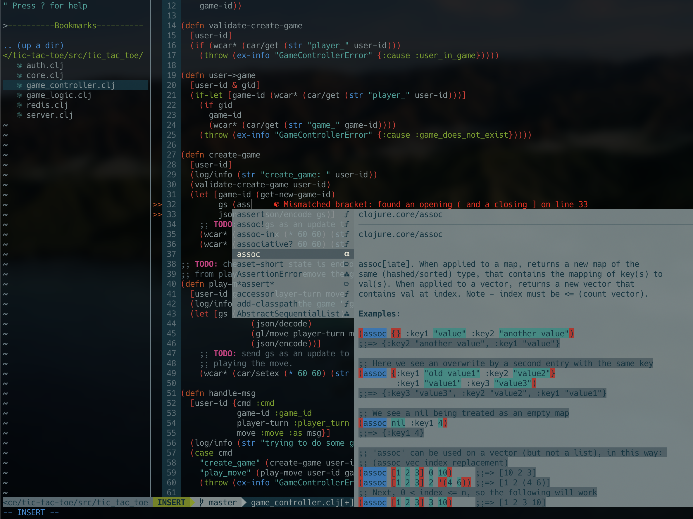

# dotfiles

This is a fork of [Takuya's dotfiles](https://github.com/craftzdog/dotfiles-public) with my own twist of Clojure support.

Note: No modifications were done on Takuya's plugins/configurations, just additions to add support for other languages.

## Plugins
- [nerdtree](https://github.com/preservim/nerdtree) - A tree explorer plugin for vim.
   - [vim-devicons](https://github.com/ryanoasis/vim-devicons) - File icons for NERDTree and other plugins.
- [tcomment_vim](https://github.com/tomtom/tcomment_vim) - An extensible & universal comment vim-plugin.
- [ale](https://github.com/dense-analysis/ale) - Asynchronous syntax checker with Language Server Protocol (LSP) support.
- [vim-fireplace](https://github.com/tpope/vim-fireplace) - Clojure REPL support for vim.
- [vim-clojure-static](https://github.com/guns/vim-clojure-static) - Meikel Brandmeyer's excellent Clojure runtime files.
- [vim-clojure-highlight](https://github.com/guns/vim-clojure-highlight) - Custom syntax highlighting that works for referred and aliased vars in Clojure buffers.
- [deoplete.nvim](https://github.com/Shougo/deoplete.nvim) - Asynchronous auto completion framework for neovim and vim 8+.
   - [async-clj-omni](https://github.com/clojure-vim/async-clj-omni) - Asynchronous Clojure completion that works with deoplete and other completion engines.
- [clj-kondo](https://github.com/clj-kondo/clj-kondo) - A linter for Clojure code that sparks joy.
